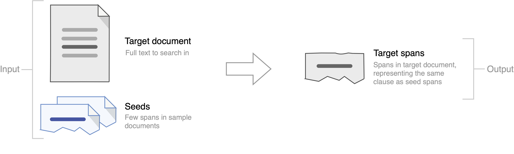

# Contract Discovery: Dataset and a Few-Shot Semantic Retrieval Challenge with Competitive Baselines

This repository contains data and additional information regarding the paper: Borchmann, Łukasz; Wiśniewski, Dawid; Gretkowski, Andrzej; Kosmala, Izabela; Jurkiewicz, Dawid; Szałkiewicz, Łukasz; Pałka, Gabriela; Kaczmarek, Karol; Kaliska, Agnieszka; Graliński, Filip. Contract Discovery: Dataset and a Few-Shot Semantic Retrieval Challenge with Competitive Baselines (to appear in Findings of EMNLP).

[[arXiv](https://arxiv.org/abs/1911.03911)]

## Semantic Retrieval Challenge
We proposed a new shared task of semantic retrieval from legal texts. A so-called _contract discovery_ is to be performed – where legal clauses are extracted from documents, given a few examples of similar clauses from other legal acts. The task differs substantially from conventional NLI and shared tasks on legal information extraction (e.g., one has to identify text span instead of a single document, page, or paragraph).

_The aim of this task is to identify spans in the requested documents (referred to as target documents) representing clauses analogous to the spans selected in other documents (referred to as seed documents)._

The _Semantic Retrieval Challenge_ directory contains a dataset in a form suitable for performing a repeated random sub-sampling validation procedure.

[[More information](semantic-retrieval-challenge/)]

## Corpus of Legal Documents, Language Models

We release a large, cleaned, plain-text corpus of legal and financial texts for unsupervised model training or fine-tuning purposes. All the available documents of [US EDGAR](http://www.www.sec.gov/edgar.shtml) as for November 19, 2018, were crawled. The resulting corpus consists of approximately 1M documents and 2B words in total (1.5G of text after _xz_ compression).

Besides, our GPT-1 and GPT-2 large models, fine-tuned on legal documents, are now publicly available. After unpacking, checkpoints can be loaded with [Transformers](https://huggingface.co/transformers/) library. Use them with default _openai-gpt_ and _gpt2-large_ tokenizers.

[[Legal Corpus](https://applica-public.s3-eu-west-1.amazonaws.com/contract-discovery/edgar.txt.xz), [Legal GPT-1](https://applica-public.s3-eu-west-1.amazonaws.com/contract-discovery/gpt-legal.tar), [Legal GPT-2](https://applica-public.s3-eu-west-1.amazonaws.com/contract-discovery/gpt2-large-legal.tar)]

